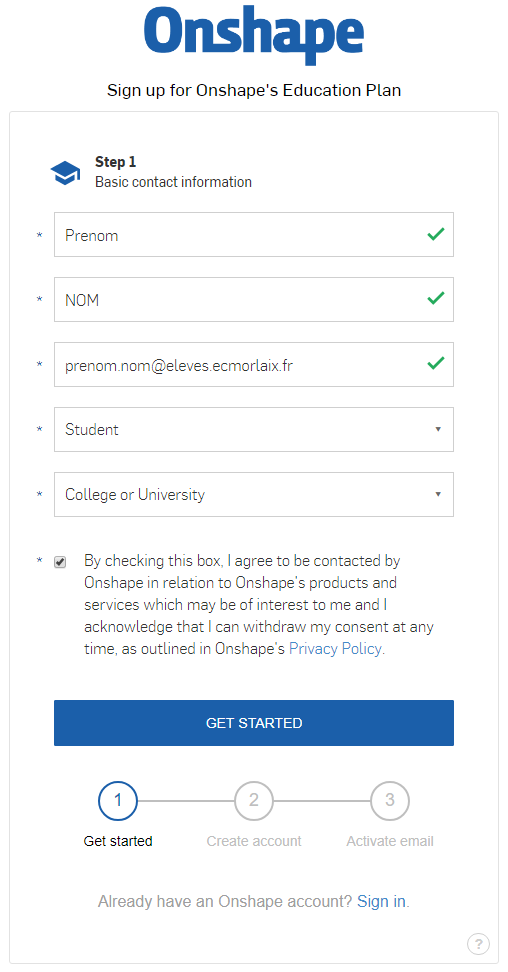
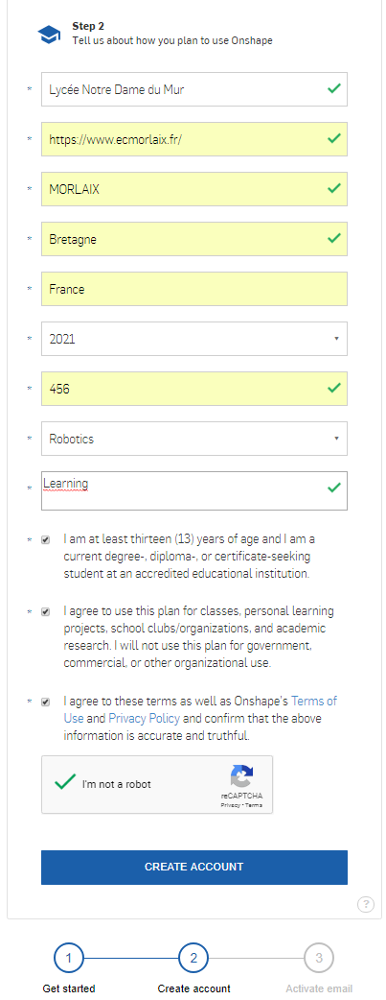

# Modélisation 3D avec [Onshape](https://www.onshape.com/){target="_blank"} 

## Présentation

<figure markdown>
  { width="70%" .center }
</figure>

<a href="https://www.onshape.com/" target="_blank">OnShape</a> est une application web qui permet de modéliser en 3D à la manière de SolidWorks mais dans un navigateur. Elle sera donc disponible sur l’ensemble de vos appareils (ordinateur, tablette, smartphone) tant au lycée qu’en dehors. 

## Inscription

???+ info "Préparation"
    
    
        
    Pour utiliser Onshape, et bénéficier gratuitement d’un compte professionnel pour l’éducation, il faut s'inscrire sur le site <a href="https://www.onshape.com/edu" target="_blank">https://www.onshape.com/edu</a> en cliquant sur le boutton <a href="https://cad.onshape.com/signup2?basicdataid=882c39dc-b273-4a58-a8f4-38562f02001a&extendeddataid=e49c85b6-e574-4303-a137-259ac45146a1&enable_cookie=check&locale=en_US&approveUser=yes&planid=EDU_YEARLY" target="_blank">"Get Started"</a>. 
    Educator et student ont les mêmes possibilités qu’un compte PRO. Pour un compte Education, le logo EDU apparaîtra sur tous les documents.

    <figure markdown>
    <figcaption>Renseigner alors tous les champs du formulaire en deux étapes.</figcaption>
    { width="60%" .center }
    { width="60%" .center }
    <figcaption>Dans une troisième étape, il faut valider l'inscription depuis le mail reçu et définir un mot de passe...</figcaption>
    </figure>
    

        Une fois le compte activé, on peut gérer les paramètres du compte à partir du menu déroulant en haut à droite, en cliquant sur "My account".
    

    

        On peut alors gérer les préférences à partir du menu listé à gauche. Il est utile notamment de changer les unités par défaut, opter pour une manipulation dans la fenêtre graphique équivalente à SolidWorks…
    

    
Par la suite, pour modéliser avec Onshape il faut se connecter sur le site <a href="https://cad.onshape.com" target="_blank">https://cad.onshape.com</a>

    
## Réalisation

???+ example "Exercice du Pion"

    <figure markdown>
      { width="50%" .center }
      <figcaption>Pion orange</figcaption>
    </figure>    

???+ example "Exercice du Support"

    <figure markdown>
      { width="70%" .center }
      <figcaption>Exemple de support possible</figcaption>
    </figure>

## Ressources :

- [Le cours de modélisation 3D de M. Lossendière​​](https://scenari.techno-melh.xyz/modelisation-3d/co/modelisation-3D-MELH.html){target="_blank"}

- Des tutoriels pour Onshape sont également disponibles sur le site : [https://learn.onshape.com](https://learn.onshape.com){target="_blank"}
          
    <ul>
        <li>
            <a href="https://www.youtube.com/channel/UCTvd5lUSLtTH8Qcd7Pl1nQg" target="_blank">Une chaine Youtube</a> ;
        </li>
        <li>
            <a href="https://forum.onshape.com/" target="_blank">Un forum</a>
        </li>
        <li>
            <a href="https://forum.onshape.com/discussion/comment/21462#Comment_21462" target="_blank">Un groupe d'utilisateur francophone​</a>
        </li>
    </ul>
    